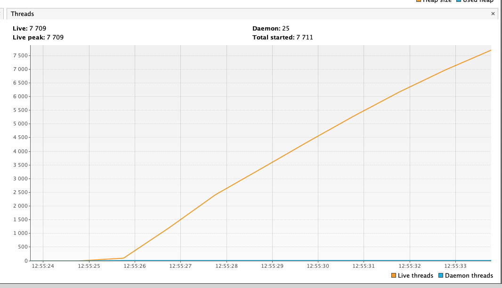
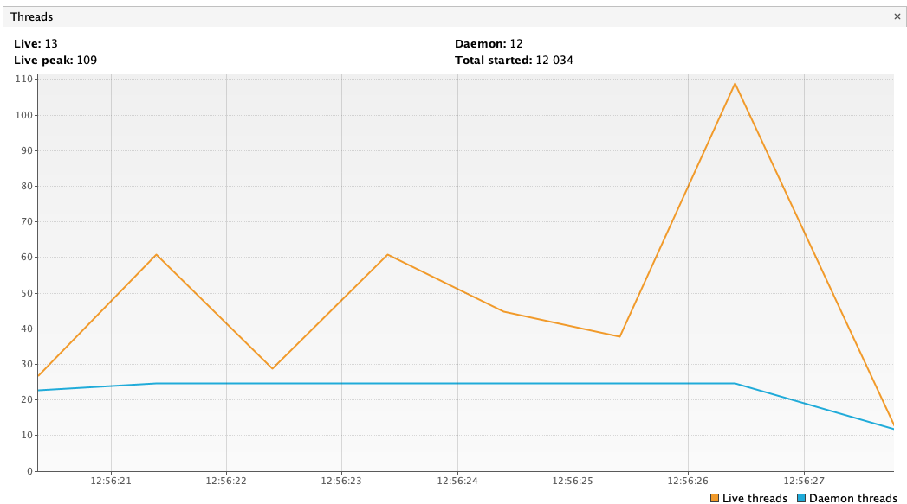

# testing-with-wiremock
How to (not) test with wiremock - jetty threads problem

Using multiple wiremock rules with default configuration leads to OutOfMemoryError on jetty QueuedThreadPool

```
java.lang.OutOfMemoryError: unable to create native thread: possibly out of memory or process/resource limits reached

	at java.base/java.lang.Thread.start(Thread.java:804)
	at org.eclipse.jetty.util.thread.QueuedThreadPool.startThread(QueuedThreadPool.java:641)
```

Threads using default [wiremock configuration for jetty stopTimeout](https://github.com/tomakehurst/wiremock/blob/6ded3d6312cd19d9466343785fd58dc717c68e6a/src/main/java/com/github/tomakehurst/wiremock/jetty9/JettyHttpServer.java#L166)


Threads using wiremock with jetty stopTimeout set as [default jetty value 30k](https://github.com/eclipse/jetty.project/blob/jetty-9.4.20.v20190813/jetty-util/src/main/java/org/eclipse/jetty/util/component/AbstractLifeCycle.java#L52) 

